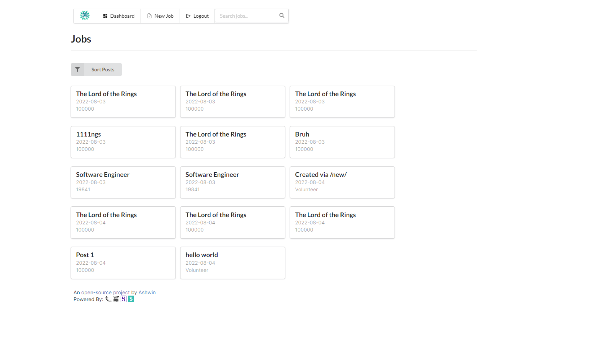

# Job Board
 A job board with user, post, and email management with support for markdown content on each listing implemented in Python via [Flask](https://flask.palletsprojects.com/).

## Installation
**NOTE**: By default all accounts listed under administrators in site.json will be given access to register, they are also super administrators and cannot be delete from the database, nor can their permissions be modified.

- Ensure Python 3.10.0+ is installed
- Download all dependencies by running `pip install -r requirements.txt`
- Start the application by running `python -m flask run` to start the Flask Application
- Visit the website live @ [https://localhost:5000/](https://localhost:5000/)

## Deploying to Heroku
**NOTE**: To deploy to Heroku you can link your GitHub repository directly to via [GitHub Integration](https://devcenter.heroku.com/articles/github-integration#enabling-github-integration) or [deploy with Git](https://devcenter.heroku.com/articles/git).

This project is deployed to Heroku via gunicorn, and you can configure the settings in the [Procfile](Procfile), if you decide to change the name of your Flask application please configure the Procfile as needed.
